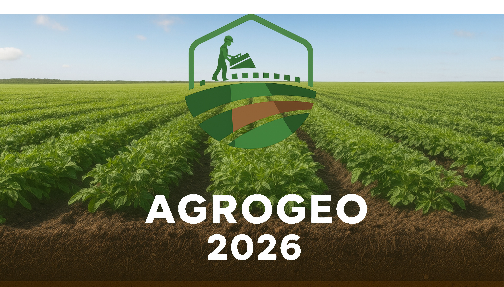
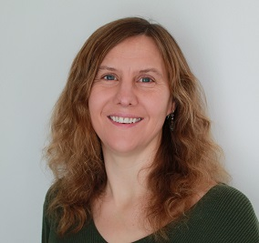
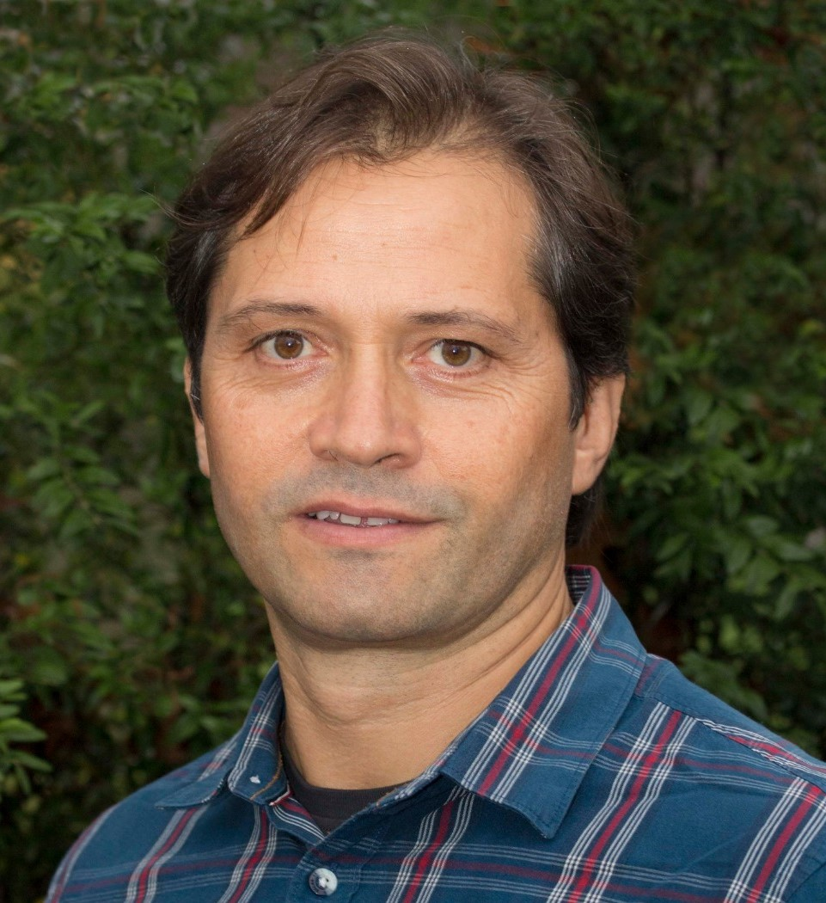
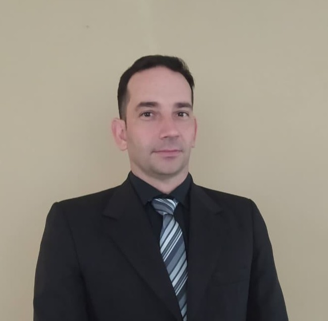
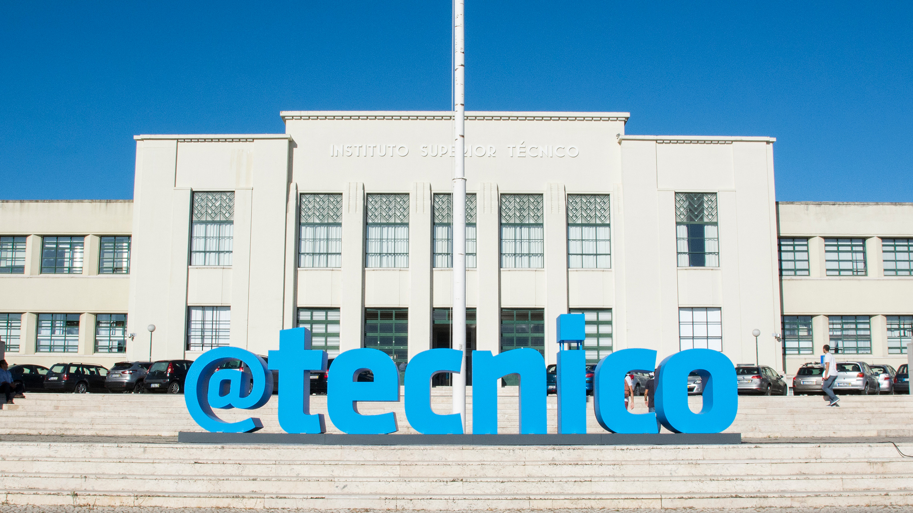
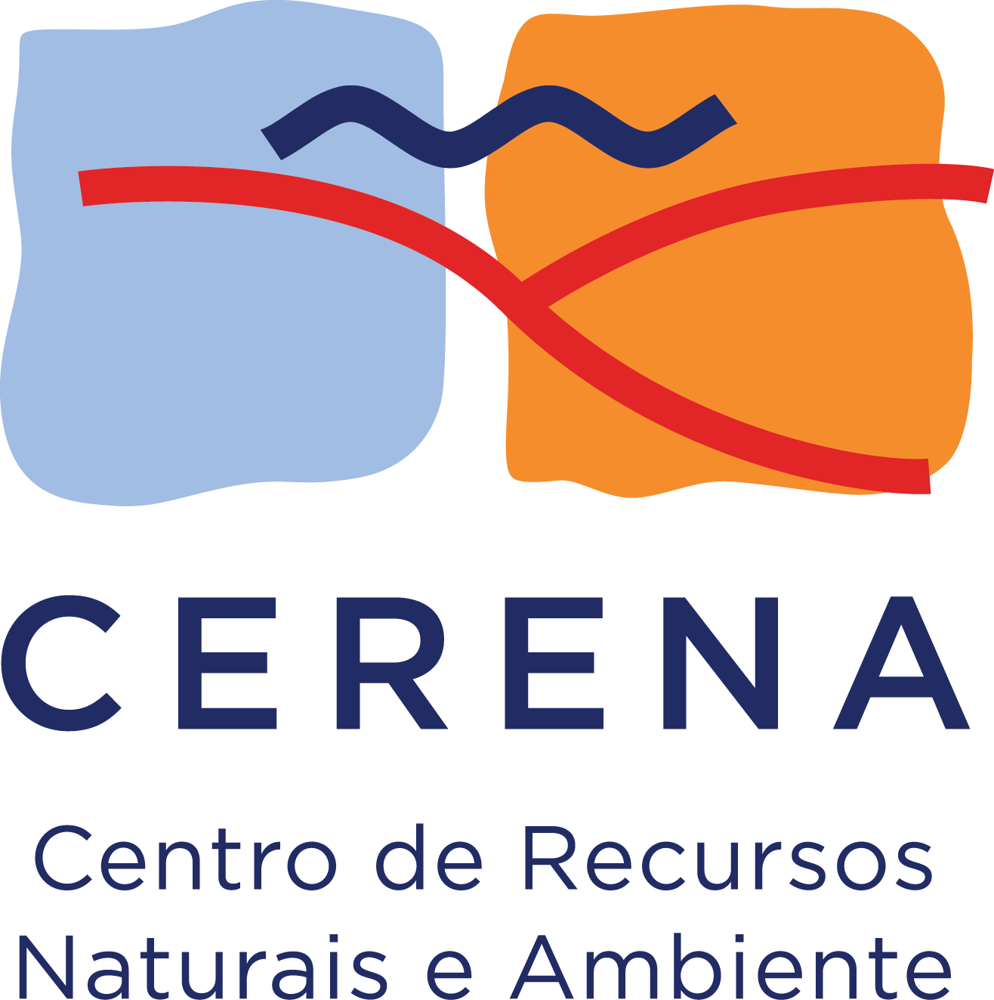



<!--
# {{ page.custom_page_title }}
-->

  
    <!--  -->

# Advances in Agrogeophysics:  Techniques and Applications in Agriculture

<!--Getting precise about precision agriculture!-->

Agriculture + geophysics = agrogeophysics! What are the current, potential and, future applications research needs? Come and discover with us!	

## Universidade de Lisboa, Lisbon 5th and 6th February 2026

<!-- Want to join? [Register now](https://www.eventbrite.com/e/3rd-agrogeophysics-seminar-illuminating-the-subsurface-tickets-719678225947?aff=oddtdtcreator) and [submit an abstract](abstracts.html)!
-->

<!-- Checkout the [Book of abstracts](https://agrogeo24.curve.space/) of the conference.
Here you can also [download it as a PDF](media/booklet_of_abstracts.pdf)
-->

<!--

  

    

      
    

    

      
    

    

      
    

    

      
    

    

      
    

    

      
    

    

      
    

    

      
    

  

  <button class="carousel-control-prev" type="button" data-bs-target="#carouselExampleAutoplaying" data-bs-slide="prev">
    
    Previous
  </button>
  <button class="carousel-control-next" type="button" data-bs-target="#carouselExampleAutoplaying" data-bs-slide="next">
    
    Next
  </button>

-->

**Abstract submission & registration**:
- <strong style="color: red;">ABSTRACT SUBMISSION OPEN UNTIL 10th of January 2026</strong>
- [SUBMIT ABSTRACT HERE](https://docs.google.com/forms/d/1J6cLbKdU2gRE9MBRH4-KTE4EWq_OxpQ1etyYrozJivk/viewform?edit_requested=true&pli=1) 
- Presentation formats: Oral and poster
- Abstract requirements: title + authors+ affiliation(s) +  250 words abstract

- Registration is open now: [REGISTER HERE](https://docs.google.com/forms/d/e/1FAIpQLSdn1yXPyqZ8suvLRPLrsYW-XMDGltkVH0woKOUe2INRsUCsfg/viewform?usp=header) 

## About this event

Agrogeophysics applies geophysical methods – including electromagnetic induction, ground-penetrating radar, electrical imaging, and seismic techniques – using platforms ranging from hand-held instruments and ground-based systems to drone- and satellite-based sensors, to study spatial and temporal patterns in the soil–water–plant system. The seminar brings together work that uses these methods to support management and decision-making in agricultural contexts, from mapping soil properties and water dynamics to exploring subsurface processes and their role in agro-ecosystems. We also invite studies addressing methodological challenges such as scaling, the development of pedophysical relationships, integration of geophysical and ancillary data, or advances in acquisition and processing techniques.

<!-- add about interactive session here? -->

## Invited speakers

  

<!--  -->

#### **Giorgio Cassiani** | Università di Padova, Italy
_"Static and dynamic aspects of non-invasive characterization and monitoring agricultural soils: assimilation with traditional probes and scale issues"_

#### **Katherine R. Grote** | Missouri University of Science and Technology, USA
_"Combined Geophysical and UAV-based Soil Property Characterization – Best Practices and Future Directions "_

#### **Joaquim João Sousa** | Universidade de Trás-os-Montes e Alto Douro, Portugal
_"Geospatial Intelligence for Precision Agriculture: Integrating Multi-Sensor Drone Data for Soil-Water-Crop Dynamics"_

#### **Julián Andrés Ramos** | Universidad de la República de Uruguay, Uruguay
_"Exploring Soil–Water Dynamics in Dryland and Irrigated Long-Term Crop Rotation Experiments in Uruguay: An Agrogeophysical Approach"_

#### **Bertille Loiseau** | HydroSciences Montpellier, France
_"From electrical resistivity tomography to soil water content: Towards a novel Ensemble Approach"_

#### **Andreas Kemna** | Universtät Bonn, Germany
_"Structural and functional characterization of crop roots with spectral electrical impedance tomography – promises and challenges"_

<!-- <a class="btn btn-primary" href="program.html" role="button">See full program</a> -->

### Workshops 

Three workshops will be proposed on the afternoon of the first day and morning of the second day:

* **Unlocking the Power of Ground Penetrating Radar in Agrogeophysics: A Hands-on Workshop | Lena Lärm and Anja Klotzsche (Forschungszentrum Jülich GmbH)**
  - This comprehensive workshop introduces the principles and applications of Ground Penetrating Radar (GPR) in agrogeophysics, highlighting its potential to non-invasively map and monitor subsurface features in agricultural environments. Participants will learn the fundamentals of GPR technology, data acquisition, and interpretation, with a focus on soil water content, root system analysis, and soil structure assessment. Next to novel processing approaches, we will highlight additionally related challenges and pitfalls.

* **OhmPi: an open-source resistivitymeter + processing timelapse ERT data: tips and tricks | Guillaume Blanchy (ILVO, Belgium), Benjamin Mary (ICA-CSIC, Department TECH4AGRO) & Roelof Versteeg (Subsurface Insights)**
  - In this workshop, participants will be able to place components on the measurements board, assemble an ohmpi system and operate it via the web interface. We will explain how the OhmPi is designed at the hardware (electronics) and software level as well as what are its capabilities and limitations. We will also explore how to diagnose potential errors and fix them.

* **Open workshop on science communication | Sarah Garré (ILVO, Belgium)**
  - We all want our research to have impact, but it is not always so easy to bring our science out there. Developing presentation skills is one important part of becoming a good science communicator, but there is so much more you can do. Depending on your target public, but also on your personal preferences, there is a wealth of ideas you can tap from. In this workshop, I will share some stories from my own experience as a science communicator and most importantly, we will work on making some your YOUR ideas more concrete together. Please bring your creativity and enthusiasm for agrogeophysics to this workshop, since those are the most important tools we will work with!

## Practical information and registration
* **Abstract submission** 
  - OPEN NOW (Deadline 10th of January 2026)
  - [SUBMIT ABSTRACT HERE](https://docs.google.com/forms/d/1J6cLbKdU2gRE9MBRH4-KTE4EWq_OxpQ1etyYrozJivk/viewform?edit_requested=true&pli=1) 
  
* **Registration** 
  - Opening: 31st of October 2025
	- Deadline: 12th January 2026
	- fees: **60€** for Students, **100€** for all other cases.
  - [REGISTER HERE](https://docs.google.com/forms/d/e/1FAIpQLSdn1yXPyqZ8suvLRPLrsYW-XMDGltkVH0woKOUe2INRsUCsfg/viewform?usp=header) 
<!-- **30** CHF invited speakers, -->

<!-- * **Arrival + conference dinner:** Wednesday January 31st, 2024 - Social dinner in the evening (18:00) -->

* **Seminar days:**
  - Thursday February 5th, 2026 (9:00 - 18:00) - oral presentations (morning) and workshop (afternoon)
  - Friday February 6th, 2026 - (9:00 - 18:00) - company fair, poster and end of workshop (morning) and oral presentations (afternoon)
  - Thursday February 5th, 2026 (Evening) - Social Dinner (fee: 60€) 
<!-- * **After conference:**
  - Saturday February 3rd, 2024 - Ski trip (for those who want, not included in the fee) -->

## Location: Instituto Superior Técnico, Lisbon, Portugal
at [Anfiteatro Abreu Faro](https://chemulisboa.weebly.com/uploads/2/6/1/8/26189991/sala_ist_2jun2014.pdf)

<figure>
	
    <figcaption>Instituto Superior Técnico, University of Lisbon</figcaption>
</figure>

### How to get there:

The conference will take place in the **Instituto Superior Técnico - Anfiteatro Abreu Faro** which is just a 8 minute walk from the subway station Alameda.

<iframe src="https://www.google.com/maps/embed?pb=!1m18!1m12!1m3!1d3112.171821865427!2d-9.141279924827627!3d38.736819171758754!2m3!1f0!2f0!3f0!3m2!1i1024!2i768!4f13.1!3m3!1m2!1s0xd1933a24aa81f17%3A0x880c7c731a54423!2sInstituto%20Superior%20T%C3%A9cnico!5e0!3m2!1sen!2sbe!4v1750787195376!5m2!1sen!2sbe" width="600" height="450" style="border:0;" allowfullscreen="" loading="lazy" referrerpolicy="no-referrer-when-downgrade"></iframe>

<!--
<iframe width="425" height="350" frameborder="0" scrolling="no" marginheight="0" marginwidth="0" src="https://www.openstreetmap.org/export/embed.html?bbox=4.362119436264039%2C50.84018189814839%2C4.368814229965211%2C50.84361336329293&amp;layer=transportmap&amp;marker=50.84189766226552%2C4.365466833114624" style="border: 1px solid black"></iframe> <small><a href="https://www.openstreetmap.org/?mlat=50.84190&amp;mlon=4.36547#map=18/50.84190/4.36547&amp;layers=T">Display map</a></small>
-->

### Accommodations
Here are three suggested hotels close to the venue:
- [Al Fonte Luminosa](https://www.fonteluminosa70.pt/) (8 minutes walk to the venue)
- [Hotel A.S. Lisboa](https://www.hotel-aslisboa.pt/) (9 minutes walk to the venue)
- [Holiday Inn Lisbon](https://www.ihg.com/holidayinn/hotels/gb/en/lisbon/lispo/hoteldetail?cm_mmc=GoogleMaps-_-HI-_-PT-_-LISPO) (10 minutes walk to the venue)
- [Ibis Lisboa Centro Saldanha | ALL - ALL (accor.com)](https://all.accor.com/hotel/2117/index.de.shtml?utm_campaign=seo+maps&utm_medium=seo+maps&utm_source=google+Maps) (18 minutes walk to the venue)

<!-- - **Exploiting clustering algorithms for spatial analysis of geophysical data**
In this workshop, you will learn the tips and tricks on how to use centroid based clustering algorithms to analyse your spatial data. Using examples you will see how clustering can help to understand spatial patterns in several example datasets. The final example will show how clustering can combine data from different remotely sensed platforms. With the help of an online Jupyter notebook, you will also have the opportunity to try clustering on your data! Bring along some example dataset to try! -->

<!-- - **Introduction to SimPEG using an example with electrical resistivity tomography (ERT)**
Come and discover the powerful open-source SimPEG framework whose development is led by UBC. You will learn how to set-up an inversion in SimPEG using an example from ERT, then you will get the chance to set up an inversion scheme yourselves and finally get some information on how to proceed for your own data set. *Prerequisites: a bit of familiarity with Python and a Google colab account*.

- **OhmPi: an open-source resistivitymeter**
This workshop is divided in three parts where participants will be able to place components on the measurements board, assemble a multiplexer and program a raspberry pi to operate the system. --> 

## Contact

Interested in participating? Get in touch! Pick the option that works best
for you.

<ul class="fa-ul my-5">
<li>
<i class="fa-li fa fa-envelope-open fa-fw" aria-hidden="true"></i>
Email <a href="mailto:abstracts.agrogeophy@gmail.com">abstracts.agrogeophy@gmail.com</a> or another <a href="committees.html">committee member</a> directly.
</li>
<li>
<i class="fa-li fab fa-slack fa-fw" aria-hidden="true"></i>
Find us on the <a href="https://join.slack.com/t/agrogeophy/shared_invite/zt-14x7c3h5f-_MziokBFPOrrFk2z2rRBIw">Agrogeophy</a> Slack (if it is the first time use this invitation link).
</li>
</ul>

 

<!--
## Sponsors

The seminar is supported by

<ul>
  <li> The <a href="http://www.soilbelgium.be/"> Soil Science Society of Belgium (SSSB) </a> – Topical committee II.Soil physics and hydrology </li>
  <li> ENVITAM doctoral school </li>
</ul>

     

-->

## Previous seminars

- 2020 <a href="http://www.soilbelgium.be/?p=3596">in Gembloux (Belgium)</a>
Geophysics conquering new territories: The rise of “agrogeophysics”

- 2022 <a href="https://agrogeophy.github.io/2nd_agrogeophysics_seminar">in Brussels (Belgium)</a>
Agriculture and Geophysics: An Electrical Meeting!

- 2024 <a href="https://agrogeophy.github.io/agrogeo24">in Zurich (Switzerland)</a>
Agriculture and Geophysics: Illuminating the subsurface!

## Collaborations

We're always interested in new collaborations and interesting projects.
We'd love to hear from you if your project or idea could benefit from our
expertise in monitoring, data analysis, inverse problems, and research software
engineering. 

**Reach out** to [our team](committees) to start a conversation!

## Sponsors
This event is supported by:

  

    
  

  

    
  

  

    
  

  

    
  

  

    
  

  
  

    
  

<!-- 

  

    
  

  

    
  

  

    
  

  <!-- 

    
  

  

    
  

  

    
  

  

    
  

  

    
  

  

    
  

 --> 

